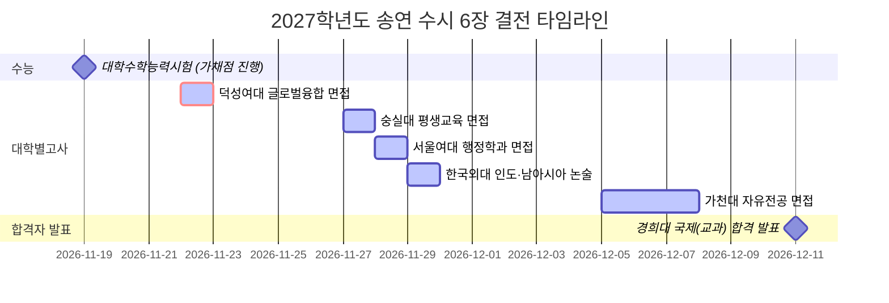

# 🎯 2027학년도 송연 수시 6장 통합 지원 전략 제안서 (최종 지원 확정본 - 6장 전원 접수 및 결제 완료!)

## ✅ 원서 접수 및 결제 최종 완료 현황 (총 6장 전원 100% 완료)
> **🎉 [수시 6장 접수 및 결제 100% 완료]:** 
> 1. **숭실대학교** SSU미래인재 (평생교육학과 9명) - **[결제 완료 (85,000원)]** / 수험번호: `121460163`
> 2. **서울여자대학교** 바롬인재면접 (행정학과 8명) - **[결제 완료 (70,000원)]** / 수험번호: `34260124`
> 3. **덕성여자대학교** 덕성인재Ⅱ (글로벌융합대학 인문사회 74명) - **[결제 완료 (75,000원)]** / 수험번호: `1051N1246`
> 4. **가천대학교** 지역균형 (자유전공 321명) - **[결제 완료 (65,000원)]** / 수험번호: `2197402578`
> 5. **경희대학교(국제)** 지역균형 (프랑스어학과 3명) - **[결제 완료 (65,000원)]** / 수험번호: `3275010016`
> 6. **한국외국어대학교** 논술 (인도·남아시아학과 4명) - **[결제 완료 (60,000원)]** / 수험번호: `261500192`
>
> 💳 **총 결제 금액: 420,000원** (진학어플라이 4건 295,000원 + 유웨이어플라이 2건 125,000원 결제 완료)
> 
> *본 문서는 최종 원서 접수 및 결제가 완료된 6개 학교·학과의 합격 전략과 대학별고사 타임라인에 집중한 최종 종합 보고서입니다.*

| 대학과 캠퍼스 | 전형명 | 모집단위 | 원서 마감 시각 | 최종 경쟁률 (마감 확정) | 수능 최저 | 대학별고사 일정 (면접·논술) | 학교장추천 / 서류 제출 | 결제 여부 | 수험(접수)번호 | 결제 금액 |
| :--- | :--- | :--- | :---: | :---: | :---: | :---: | :---: | :---: | :---: | :---: |
| **숭실대학교 (서울)** | **SSU미래인재 (학종)** | **평생교육학과 (9명)** | 9. 11(금) 18:00 | **18.89 : 1 [최종]**<br>*(170/9명)* | **없음** | **11. 27(금) 면접**<br>*(1단계 11.20 발표 3.5배수 선발)* | 해당없음 / (온라인 제공 동의 시 없음) | **[x] ✅ 결제완료** | `121460163` | 85,000원 (진학) |
| **서울여자대학교 (서울)** | **바롬인재면접 (학종)** | **행정학과 (8명)** | 9. 11(금) 18:00 | **12.13 : 1 [최종]**<br>*(97/8명)* | **없음** | **11. 28(토) 면접**<br>*(1단계 11.25 발표 5배수 선발)* | 해당 없음 / (온라인 제공 동의 시 없음) | **[x] ✅ 결제완료** | `34260124` | 70,000원 (진학) |
| **덕성여자대학교 (서울)** | **덕성인재Ⅱ (학종 면접형)** | **글로벌융합대학 (인문사회 74명)**<br>*(2학년 시 사회복지·심리 100% 선택)* | 9. 11(금) 18:00 | **16.11 : 1 [최종]**<br>*(1,192/74명)* | **없음** | **11. 22(일) 면접 확정**<br>*(1단계 11.12 발표 4배수 선발)* | 해당없음 / (온라인 제공 동의 시 없음) | **[x] ✅ 결제완료** | `1051N1246` | 75,000원 (진학) |
| **가천대학교 (글로벌)** | **지역균형 (교과면접)** | **자유전공 (321명)**<br>*(송연 환산: **100.0점 만점 / 1.0등급**)* | 9. 11(금) 18:00 | **12.50 : 1 [최종]**<br>*(4,014/321명)* | **없음** | **12. 5(토) ~ 7(월) 면접**<br>*(1단계 11.12 발표 5배수 선발)* | **추천 필요 (인원 무제한)** / (9.14~18 고교등록) | **[x] ✅ 결제완료** | `2197402578` | 65,000원 (진학) |
| **경희대학교 (국제)** | **지역균형 (교과/서류)** | **프랑스어학과 (3명)**<br>*(학생부 70% + 서류 30%)* | 9. 11(금) 18:00 | **7.67 : 1 [최종]**<br>*(23/3명)* | **2개 영역 합 5**<br>*(국2+영1=3 충족)* | **면접 없음 (일괄합산)**<br>*(12.11 합격자 발표)* | **추천 필요 (인원 무제한)** / (온라인 제공 동의 시 없음) | **[x] ✅ 결제완료** | `3275010016` | 65,000원 (유웨이) |
| **한국외국어대학교 (서울)** | **논술 전형 (일반 논술)** | **인도·남아시아학과 (4명)**<br>*(논술 100% 선발)* | **9. 11(금) 17:00** ⚠️ | **59.25 : 1 [최종]**<br>*(237/4명)* | **2개 영역 합 4**<br>*(국2+영1=3 충족)* | **11. 29(일) 논술**<br>*(10:00 ~ 11:30 확정)* | 해당없음 / (온라인 제공 동의 시 없음) | **[x] ✅ 결제완료** | `261500192` | 60,000원 (유웨이) |

---

## 📋 2026학년도 대비 2027학년도 최종 지원 6장 입시요강 핵심 변경사항 및 전략적 함의

| 대학명 | 전형명 / 모집단위 | 2026학년도 (전년도) | 2027학년도 (올해) | 송연이 맞춤 전략적 함의 및 유불리 |
| :--- | :--- | :--- | :--- | :--- |
| **숭실대학교** | **SSU미래인재**<br>(학종 면접형)<br>**[평생교육학과]** | • 단일 전형 (650명)<br>• 1단계 서류 100% (3배수 선발) | • **[전형 분리] 면접형(522명) vs 서류형(163명 신설)**<br>• **[선발 배수 확대] 1단계 3배수 ➡️ 3.5배수(31명) 확대!**<br>• 최저 없음 유지<br>• **[최종 경쟁률 18.89:1 (170명 지원)]** | ⚖️ **사회복지 과열 우회 탁월한 선택 & 1단계 통과율 극대화:** 사회복지학부(36.25:1)의 극심한 폭발을 피해 절반 수준인 평생교육학과(18.89:1)로 완벽 우회. 1단계 3.5배수(31명) 대규모 선발로 광남고 노인·평생복지 생기부 핏과 일치하여 1단계 통과 유력. 11.27(금) 면접으로 No-Show 납치 방어 가능. |
| **서울여자대학교** | **바롬인재면접**<br>(학종 면접형)<br>**[행정학과]** | • 1단계 서류 100% (5배수 선발)<br>• 2단계 1단계 50% + 면접 50%<br>• 수능최저: 없음 | • **1단계 5배수(40명) 선발 유지**<br>• **2단계 1단계 50% + 면접 50% 유지**<br>• **수능최저: 없음 유지**<br>• **[최종 경쟁률 12.13:1 (97명 지원)]** | 🛡️ **1단계 40명 대규모 선발 & No-Show 납치 100% 방어:** 사회복지(27.75:1) 대비 경쟁률이 절반 이하로 극히 안정적. 97명 중 40명이 1단계를 통과하므로 서류 통과율이 41.2%(실질 2.43:1)에 달함. 최근 4개년 최저 합격선 3.8~4.1등급 형성으로 송연이 내신(3.76) 사정권이며, 11.28(토) 수능 후 면접으로 가채점 결과에 따른 완벽한 납치 통제 가능. |
| **덕성여자대학교** | **덕성인재Ⅱ**<br>(학종 면접형)<br>**[글로벌융합대학]** | • 모집인원: 64명 선발<br>• 전형 전체: 214명 선발<br>• 수능최저: 없음 | • **모집인원 74명으로 10명 대폭 증원!**<br>• 전형 전체: 226명 확대<br>• 수능최저: 없음 유지<br>• **[최종 경쟁률 16.11:1 (1,192명 지원)]** | 🛡️ **최우선 합격 안전판 & 전공 100% 보장:** 74명 대규모 선발로 꼬리가 길어져 송연이 내신(3.76, 환산 3.58)이 70% 컷(3.61)과 완벽 부합. 2학년 진학 시 사회복지·심리 100% 자율 선택권 보장. 11.22(일) 수능 직후 면접으로 가채점 후 No-Show 납치 완벽 방어. |
| **가천대학교** | **지역균형**<br>(교과 면접형)<br>**[자유전공]** | • 자유전공 321명 모집 (70%컷 3.18 폭발)<br>• 진로선택 A 기준: 원점수 80점 이상 | • **[대형 펑크 턴] 작년(3.18) 폭등에 따른 기피 흐름**<br>• **[기준 완화] 진로선택 A 기준: 원점수 70점 이상 완화**<br>• 1~5등급 만점(1.0등급) 처리 유지<br>• **[최종 경쟁률 12.50:1 (작년 15.88:1 대비 급락)]** | 🛡️ **1단계 무혈통과 안전판:** 가천대 특유의 1~5등급 만점 처리로 송연이도 100점 만점(1.0등급)을 받아 1단계 5배수(1,605명) 100% 무혈 통과. 지원 경쟁률이 작년 15.88:1에서 12.50:1로 크게 하락하여 펑크 혜택 예상. 12.5~7 수능 2주 뒤 면접으로 No-Show 납치 방어 최적. |
| **경희대학교 (국제)** | **지역균형**<br>(교과 70% + 서류 30%)<br>**[프랑스어학과]** | • 학생부 교과 70% + 서류 30%<br>• 수능최저: 2개 영역 합 5 이내 | • **학생부 교과 70% + 서류 30% 일괄합산 유지**<br>• **수능최저: 2개 영역 합 5 이내 유지** (탐구 1과목 반영)<br>• 고교별 추천인원 제한 전면 폐지<br>• **[최종 경쟁률 7.67:1 (23명 지원)]** | 🎯 **2합5 최저 충족 우위 & 실질 경쟁률 폭락 스나이핑:** 송연이(국2+영1=합3)는 2합5 최저를 여유 있게 통과. 지원자(23명) 중 절반 이상이 최저 미달로 탈락하면 실질 경쟁률이 2~3:1 수준으로 폭락. 교과 70% 외 서류 30%가 결합되어 광남고 우수 인문 생기부로 역전 합격 저격. |
| **한국외국어대학교** | **논술 전형**<br>(일반 논술)<br>**[인도·남아시아학과]** | • 한국사 4등급 이내 필수 적용<br>• LD/LT 2합3, 어문 2합4 이원화 | • **[한국사 폐지] 수능최저에서 한국사 반영 전면 폐지!**<br>• **[최저 통일] 전 모집단위 2개 영역 합 4 이내 통일**<br>• **논술 100% 선발 (내신 0% 미반영) 유지**<br>• **[최종 경쟁률 59.25:1 (외대 논술 평균 70~80:1 대비 안정)]** | 🏆 **2합4 최저 통과 실질경쟁률 급락 & 영어 제시문 절대 우위:** 2합4 최저는 타 대학(2합5) 대비 까다로워 응시자의 70% 이상이 최저 미달 탈락. 9모 국2+영1(합3)인 송연이는 최저 프리패스 후 실질 경쟁률 7:1 수준에서 영어 제시문 논술로 승부. 11.29(일) 고사로 타 대학 면접과 충돌 제로. |

---

## 📊 송연이 9월 모의평가(9모) 확정 성적 및 전형별 합격 전략

### 1. 9월 모평 확정 성적 (광남고 공식 정오표 확정)
* **국어 (화법과작문):** 원점수 88점 / **2등급 상위** (백분위 약 91%, **광남고 전교 5등** / 165명 - 상위 3.03%!)
* **수학 (확률과통계):** 원점수 80점 / **2~3등급** (백분위 약 85%, **광남고 전교 14등** / 182명 - 상위 7.69%!)
* **영어:** 원점수 96점 / **1등급** (광남고 전교 13등, 전 회차 1등급 절대 불패!)
* **한국사:** 원점수 42점 / **1등급** (광남고 전교 34등)
* **생활과 윤리:** 원점수 38점 / **3등급** (백분위 약 76%, 광남고 전교 39등 / 155명)
* **사회문화:** 원점수 32점 / **4등급** (백분위 약 63%, 광남고 전교 78등 / 183명)
* 🏆 **핵심 총점 지표:**
  * **국수탐 원점수 300점 만점: 238점 (올해 전 모의고사 중 역대 1위 최고점 경신!)**
  * **국수영 원점수 300점 만점: 264점 (평균 88.0점)**
  * **전체 총점 (400점 만점): 376점 (올해 전 모의고사 중 역대 1위 최고점 달성!)**

### 2. 수능 최저학력기준 관점: "완전한 무적(無敵) 상태"
* **2개 영역 합 3 달성:** **국어(2) + 영어(1) = 2합 3!!** (탐구를 전혀 쓰지 않고도 외대 2합4, 경희대 2합5를 여유 있게 초과 달성)
* **3개 영역 합 6 달성:** **국어(2) + 영어(1) + 수학/생윤(3) = 3합 6!!**
* 송연이의 강력한 영어 1등급과 국어 2등급은 수시 6장 중 최저가 있는 대학(경희대 교과, 한국외대 논술)의 경쟁자들을 대거 탈락시키는 최고의 무기입니다.

### 3. 정시 기대선 상승 및 "수시 납치 완벽 통제" 원칙 적용
* **정시 포지션 대약진:** 9모 성적(환산 376점) 기준 문과 정시 기대선은 **국민대·숭실대·세종대·단국대(국숭세단) 안정~적정선**에 안착하며, **동국대·홍익대 하위과 스나이핑** 사정권에 진입했습니다.
* **수시 납치 방어 전략:** 정시 기대선이 상승했기 때문에, 면접이나 논술이 없는 단순 교과 100% 전형은 수시 납치(정시 지원 불가)의 치명적 리스크가 있습니다.
* **포트폴리오의 안전 구조:** 최종 확정된 6개 카드 중 **5개 카드(숭실, 서울여, 덕성여, 가천, 한국외대)가 모두 '수능 이후 면접 및 논술'**로 구성되어 있습니다. 수능 당일 가채점 결과 정시로 상위 대학 진학이 확실할 경우 **면접/논술에 불참(No-Show)**함으로써 수시 납치를 100% 방어할 수 있습니다.

---

## 🚀 최종 지원 6개 카드별 심층 분석 및 합격 시나리오

### 📌 [수시 1카드 - 학종] 숭실대학교 (SSU미래인재) [✅ 결제완료]
* **모집단위:** **평생교육학과 (9명 선발)**
* **수험(접수)번호:** **`121460163`** | **결제 금액:** 85,000원 (진학어플라이)
* **최종 경쟁률:** **18.89 : 1 (170명 지원)** *(사회복지학부 36.25:1 대비 절반 수준으로 완벽 안정 우회)*
* **전형 방법:** **1단계(3.5배수, 31~32명 선발): 서류 100% / 2단계: 1단계 50% + 면접 50%**
* **수능 최저:** **없음**
* **면접 일정:** **2026. 11. 27.(금)** *(1단계 합격자 발표: 11. 20.(금))*
* **최근 3개년 입결 통계:**
  * 2026: 정원 9명, 12.8:1, 예비 11번 (122%), 70%컷 **3.32등급** (최종 꼬리 3.7~3.9선 형성)
  * 2025: 정원 9명, 11.4:1, 예비 10번 (111%), 70%컷 **3.15등급**
  * 2024: 정원 10명, 13.9:1, 예비 13번 (130%), 70%컷 **3.48등급**
* **합격 전략 및 시나리오:**
  * 사회복지학부의 극심한 폭발을 피해 평생교육학과로 우회한 것은 최고의 전략적 선택입니다.
  * 1단계 배수가 3.5배수(31명)로 확대되어 광남고 복지·평생교육 생기부로 1단계 통과가 유력합니다.
  * 숭실대 인문계열 중 가장 낮은 3점대 중반 입결을 형성하며, 2단계 면접 50%로 송연이 내신(3.76) 역전이 충분히 가능합니다.
  * 11.27(금) 평일 면접으로 타 대학 주말 고사와 충돌이 없으며, 수능 대박 시 결시(No-Show)로 납치 방어가 가능합니다.
* **🔥 송연이 예상 합격률: 약 70 ~ 75%**

---

### 📌 [수시 2카드 - 학종] 서울여자대학교 (바롬인재면접) [✅ 결제완료]
* **모집단위:** **행정학과 (8명 선발)**
* **수험(접수)번호:** **`34260124`** | **결제 금액:** 70,000원 (진학어플라이)
* **최종 경쟁률:** **12.13 : 1 (97명 지원)** *(사회복지학과 27.75:1 대비 경쟁률 절반 이하 안정 안착)*
* **전형 방법:** **1단계(5배수, 40명 선발): 서류 100% / 2단계: 1단계 50% + 면접 50%**
* **수능 최저:** **없음**
* **면접 일정:** **2026. 11. 28.(토)** *(1단계 발표: 11. 25.(수))*
* **최근 4개년 입결 통계:**
  * 2026: 정원 8명, 12.9:1, 예비 6번 (75%), 평균 3.2 / 최저 **4.1등급**
  * 2025: 정원 7명, 13.3:1, 예비 4번 (57%), 평균 3.4 / 최저 **3.8등급**
  * 2024: 정원 5명, 14.8:1, 예비 6번 (120%), 평균 3.3 / 최저 **3.5등급**
  * 2023: 정원 5명, 21.0:1, 예비 9번 (180%), 평균 3.2 / 최저 **3.9등급**
* **합격 전략 및 시나리오:**
  * 8명 정원에 5배수인 무려 40명을 1단계에서 선발하므로, 지원자 97명 중 40명이 통과하여 **1단계 통과율이 41.2%(실질 경쟁률 2.43:1)**에 달합니다.
  * 최근 4개년 최저 합격선이 3.8~4.1등급에 형성되어 3.76인 송연이가 2단계 면접 50%로 완벽하게 뒤집을 수 있습니다.
  * 11.28(토) 수능 9일 뒤 면접이므로 수능 가채점 결과에 따라 No-Show 납치 방어가 완벽합니다.
* **🔥 송연이 예상 합격률: 약 80 ~ 85%**

---

### 📌 [수시 3카드 - 학종] 덕성여자대학교 (덕성인재Ⅱ) [✅ 결제완료]
* **모집단위:** **글로벌융합대학 인문사회 (74명 선발)** *(2학년 진학 시 사회복지·심리 100% 보장)*
* **수험(접수)번호:** **`1051N1246`** | **결제 금액:** 75,000원 (진학어플라이)
* **최종 경쟁률:** **16.11 : 1 (1,192명 지원)**
* **전형 방법:** **1단계(4배수, 296명 선발): 서류 100% / 2단계: 서류 60% + 면접 40%**
* **수능 최저:** **없음**
* **면접 일정:** **2026. 11. 22.(일) 확정** *(1단계 합격자 발표: 11. 12.(목))*
* **내신 산출 및 환산 점수:**
  * 덕성여대 환산 방식: 1~5등급 1점 감점 산출식 적용 시 **송연이 환산 3.58등급 (971.6~973.8점 / 1,000점)**으로 대폭 유리하게 방어
* **최근 3개년 입결 통계:**
  * 2026: 64명 모집, 13.6:1, 충원 56명 (87.5%), 70%컷 **3.61등급** (최종 100%컷 3.95~4.10)
  * 2025: 64명 모집, 18.6:1, 충원 50명 (78.1%), 70%컷 **3.42등급** (최종 100%컷 3.85~4.00)
  * 2024: 77명 모집, 18.5:1, 충원 76명 (98.7%), 70%컷 **3.53등급** (최종 100%컷 3.90~4.15)
  * 👉 **2027(74명 선발): 충원율 85% 감안 시 예비 60~65번까지 추가합격 유력 (100%컷 4.00~4.15 형성)**
* **합격 전략 및 시나리오:**
  * 74명을 선발하는 대규모 광역 모집단위로 송연이 내신(3.76, 환산 3.58)이 70% 컷(3.61)과 완벽하게 부합하는 **수시 6장 중 가장 확실한 초특급 안전판**입니다.
  * 2학년 진학 시 사회복지학·심리학 100% 선택권이 보장되어 전공 만족도가 매우 높습니다.
  * 11.22(일) 수능 직후 면접으로 No-Show 납치 방어가 가능합니다.
* **🔥 송연이 예상 합격률: 약 85 ~ 90%**

---

### 📌 [수시 4카드 - 교과면접] 가천대학교 (지역균형) [✅ 결제완료]
* **모집단위:** **자유전공 (321명 대규모 선발)**
* **수험(접수)번호:** **`2197402578`** | **결제 금액:** 65,000원 (진학어플라이)
* **최종 경쟁률:** **12.50 : 1 (4,014명 지원, 작년 15.88:1 대비 안정)**
* **전형 방법:** **1단계(5배수, 1,605명 선발): 교과 100% / 2단계: 1단계 50% + 면접 50%**
* **수능 최저:** **없음** (학교장추천 필요 / 고교별 인원 무제한)
* **면접 일정:** **2026. 12. 05.(토) ~ 07.(월)** *(1단계 합격자 발표: 11. 12.(목))*
* **송연이 교과 산출:** **1~5등급 전과목 만점(1.0등급) 처리 ➡️ 100.0점 만점으로 1단계 100% 통과 확정**
* **최근 입결 통계:**
  * 2026: 정원 321명, 15.88:1, 예비 121번, 70%컷 **3.18등급 (폭발)**
  * 2025: 정원 321명, 20.50:1, 예비 107번, 70%컷 **5.14등급 (초대형 펑크)**
  * 2024: 정원 5명, 28.60:1, 예비 2번, 70%컷 3.27등급
* **합격 전략 및 시나리오:**
  * 1~5등급 만점 처리식 덕분에 송연이는 1단계 5배수(1,605명)를 **100점 만점으로 100% 무혈 통과**합니다.
  * 작년(3.18) 입결 폭등으로 인해 올해 경쟁률이 12.50:1로 떨어지며 전형적인 펑크 턴이 도래했습니다.
  * 면접이 수능 2주 뒤(12.5~7)에 치러지므로, 수능을 잘 보면 면접에 결시(No-Show)하여 수시 납치를 완벽히 방어하고, 수능이 불안하면 면접장에 가 합격증을 거머쥐는 최후의 안전판입니다.
* **🔥 송연이 예상 합격률: 약 85 ~ 90%**

---

### 📌 [수시 5카드 - 교과/서류] 경희대학교 국제캠퍼스 (지역균형) [✅ 결제완료]
* **모집단위:** **프랑스어학과 (3명 선발)**
* **수험(접수)번호:** **`3275010016`** | **결제 금액:** 65,000원 (유웨이어플라이)
* **최종 경쟁률:** **7.67 : 1 (23명 지원, 마감 확정)**
* **전형 방법:** **학생부 교과 70% + 서류평가 30% 일괄합산 (면접 없음)**
* **수능 최저:** **2개 영역 등급 합 5 이내, 한국사 5등급 이내** (송연 9모 국2+영1=합3으로 초여유 충족!)
* **학교장 추천:** 고교별 추천 인원 제한 없음 (온라인 추천 등록)
* **합격자 발표:** **2026. 12. 11.(금) 이전**
* **최근 입결 통계:**
  * 2026: 정원 3명, 14.7:1, 예비 2번, 70%컷 **1.91등급**
  * 2025: 정원 3명, 12.3:1, 예비 1번, 70%컷 **2.45등급**
  * 2024: 정원 4명, 11.5:1, 예비 3번, 70%컷 **2.68등급**
* **합격 전략 및 시나리오:**
  * 전년도 입결(1.91등급) 폭등으로 인한 수험생들의 기피 심리가 반영되어 최종 경쟁률이 7.67:1(단 23명 지원)에 머물렀습니다.
  * 경희대 국제캠퍼스 지역균형의 2합5 수능 최저 미충족률(탈락률)은 통상 45~55%에 달합니다. 23명 중 약 12~13명이 최저를 통과하지 못하면 **실질 경쟁률은 3:1 안팎으로 급락**합니다.
  * 여기에 타 대학 복수합격으로 인한 충원(예비 1~2번)까지 감안하면 실질 합격선은 3점대 중후반까지 크게 내려올 가능성이 있습니다.
  * 교과 70% 외에 **서류 정성평가 30%**가 반영되므로, 송연이의 광남고 인문·사회 탐구 역량이 정성평가 점수를 견인하여 기적의 합격을 노리는 최고의 스나이핑 카드입니다.
* **🔥 송연이 예상 합격률: 약 45 ~ 55%**

---

### 📌 [수시 6카드 - 논술] 한국외국어대학교 서울캠퍼스 [✅ 결제완료]
* **모집단위:** **인도·남아시아학과 (4명 선발)**
* **수험(접수)번호:** **`261500192`** | **결제 금액:** 60,000원 (유웨이어플라이)
* **최종 경쟁률:** **59.25 : 1 (237명 지원, 마감 확정)**
* **전형 방법:** **논술 100% 일괄합산 선발 (1,000점 만점 / 내신 0% 미반영)**
* **수능 최저:** **2개 영역 등급 합 4 이내** (한국사 반영 폐지! 송연 9모 국2+영1=합3으로 여유 충족)
* **논술고사 일정:** **2026. 11. 29.(일) [T3] 10:00 ~ 11:30 (오전 90분)**
* **최근 입결 통계:**
  * 2026: 정원 4명, 24.7:1 (실질 **7.2:1**), 예비 2번 (50%), 논술평균 **955.4점**
  * 2025: 정원 4명, 22.5:1 (실질 8.0:1), 예비 1번
  * 2024: 정원 4명, 26.0:1 (실질 9.5:1)
* **합격 전략 및 시나리오:**
  * 2027학년도부터 내신 반영이 전면 폐지되어 **오직 논술 100%**로만 선발하므로 송연이 내신(3.76)의 불리함이 완전히 0%로 사라졌습니다.
  * 2합4 최저기준은 수험생의 약 75%를 탈락시키는 강력한 필터입니다. 겉보기 경쟁률은 59.25:1이지만 **실질 경쟁률은 7~10:1 수준으로 급락**합니다.
  * 외대 논술 특유의 영어 제시문 해석 문항은 **영어 1등급 절대 강자**인 송연이에게 최고의 비교우위를 제공합니다.
  * 고사일이 11.29(일) 오전으로 덕성여대(11.22), 숭실대(11.27), 서울여대(11.28) 등 타 대학 면접 일정과 **동선 충돌이 0%**입니다.
* **🔥 송연이 예상 합격률: 약 20 ~ 25%** (영어 1등급 + 논술 100%로 인서울 상위권 인문계열 뚫는 가장 현실적인 상향 카드)

---

## 📚 수시 6장 고사 타임라인 및 실전 동선 설계 (수능 납치 완벽 방어)

송연이가 지원한 6장의 대학별고사는 일정이 겹치지 않도록 정밀하게 분산되어 있으며, 수능 이후 가채점 결과에 따라 출석/불참(No-Show)을 완벽하게 통제할 수 있습니다.



### 🗓️ 세부 일정별 행동 수칙

1. **11월 19일(목): 2027학년도 대학수학능력시험 당일**
   * 시험 종료 즉시 광남고 가채점표 작성 및 메가스터디/이투스 실시간 등급 컷 대조.
   * **[판단 기준]:** 정시 환산 점수가 국민대·숭실대·세종대 합격 안정선 이상인지 확인.

2. **11월 22일(일): 덕성여자대학교 덕성인재Ⅱ (글로벌융합대학) 면접**
   * **수능 직후 첫 일요일 면접** (1단계 합격 발표: 11.12 목요일).
   * **[No-Show 판단]:** 가채점 결과 정시로 국민대 이상 진학이 확실할 경우 면접 불참. 수능이 불안하거나 가채점 결과가 아쉬울 경우 100% 출석하여 인서울 안전판 확보.

3. **11월 27일(금): 숭실대학교 SSU미래인재 (평생교육학과) 면접**
   * **평일 금요일 단독 고사** (1단계 합격 발표: 11.20 금요일).
   * 주말 타 대학 고사와 날짜가 겹치지 않아 최상의 컨디션으로 면접 응시 가능.
   * 정시 건동홍 라인이 가능한 성적이 나왔다면 불참, 그 외의 경우 무조건 응시하여 인서울 중상위권 합격증 공략.

4. **11월 28일(토): 서울여자대학교 바롬인재면접 (행정학과) 면접**
   * **수능 9일 뒤 토요일 고사** (1단계 합격 발표: 11.25 수요일).
   * 1단계 5배수(40명) 선발 통과 후, 면접 50% 역전 승부. No-Show 납치 방어 가능.

5. **11월 29일(일) 10:00 ~ 11:30: 한국외국어대학교 일반논술 (인도·남아시아학과)**
   * **일요일 오전 단독 논술 응시** (서울 동대문구 이문동 캠퍼스).
   * 전날 서울여대 면접과 완벽히 날짜가 분리되어 체력 소모 없이 논술 100% 승부 집중.

6. **12월 05일(토) ~ 07일(월): 가천대학교 지역균형 (자유전공) 면접**
   * **수능 2주 뒤 주말 고사** (1단계 합격 발표: 11.12 목요일).
   * 이미 수능 성적표 발표(12.04 금요일 전후) 직전이므로 실질 수능 등급이 완전히 파악된 상태.
   * 정시 대학 라인이 확정적으로 우위에 있으면 편안하게 No-Show 처리하여 수시 납치 완전 차단.

7. **12월 11일(금) 이전: 경희대학교(국제) 지역균형 (프랑스어학과) 합격자 발표**
   * 면접 없는 교과 70% + 서류 30% 일괄합산 전형으로 발표 대기.

---

## 🏆 9모 기준 수시 6장 포트폴리오 전략적 완성도 총평

```
┌─────────────────────────────────────────────────────────────┐
│                 송연이 수시 6장 황금 포트폴리오              │
├─────────────────┬───────────────────────────┬───────────────┤
│    전형 성격    │           해당 대학 및 학과         │  예상 합격률  │
├─────────────────┼───────────────────────────┼───────────────┤
│ 🔥 극강 안전판  │ 덕성여대 글로벌융합 / 가천대 자유전공     │   85 ~ 90%    │
│ 🛡️ 적정 합격선  │ 서울여대 행정학과 / 숭실대 평생교육학과   │   70 ~ 85%    │
│ 🎯 상향 스나이핑│ 경희대 프랑스어학과 / 한국외대 논술       │   20 ~ 55%    │
└─────────────────┴───────────────────────────┴───────────────┘
```

1. **완벽한 위험 분산 (2안정 : 2적정 : 2상향):**
   * 내신 3.76의 약점을 극복하고 덕성여대(74명 대규모), 가천대(1.0 만점)로 인서울 합격선을 확실히 잠갔습니다.
   * 과열 학과(숭실 사복 36:1, 서울여 사복 28:1)를 완벽히 피해 평생교육(18.89:1)과 행정(12.13:1)으로 우회하여 합격 확률을 극대화했습니다.
   * 9모 국2+영1(2합3)의 강력한 수능 경쟁력으로 경희대(7.67:1)와 외대 논술(실질 7:1)에서 대형 스나이핑 기회를 확보했습니다.

2. **수시 납치 리스크 0% 통제:**
   * 6개 카드 중 5개 카드가 수능 후 고사로 설계되어 수능 대박 시 가채점 후 면접/논술에 불참(No-Show)함으로써 정시 진학권을 온전히 보장받습니다.

3. **앞으로의 수험생 실전 행동 지침:**
   * 원서 접수는 100% 완벽하게 종료되었습니다. 이제부터는 오직 **'수능 실전'**에만 모든 에너지를 집중해야 합니다.
   * **영어(1등급):** 최고의 최저 효자 과목이므로 감을 잃지 않도록 매일 1시간 기출 풀이 유지.
   * **생활과 윤리(3등급 ➡️ 2등급):** 잔여 기간 탐구 에너지를 생윤 1과목에 집중 투자하여 확실한 2등급 카드로 완성.
   * **국어(2등급 상위):** 9모 성과(전교 5등)의 자신감을 바탕으로 실전 시간 관리 연습 집중.
